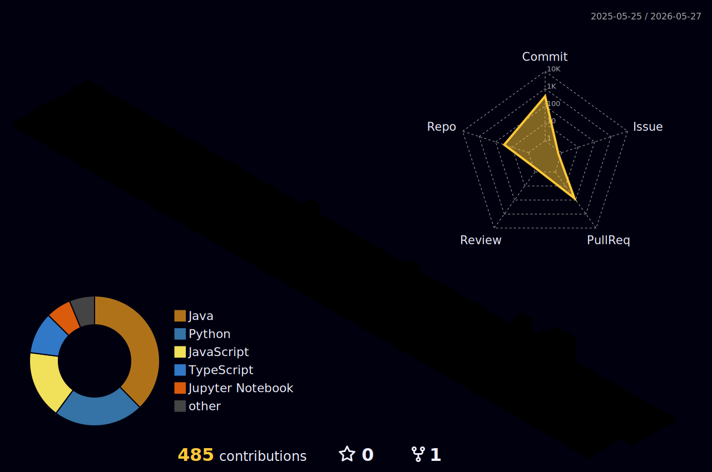

  

---

# About

- AIML Student focused on **Machine Learning & Deep Learning**
- Strong interest in **systems, optimization, and performance**
- Comfortable with **Python, C, C++**
- I build things for fun and hopefully works

---

# GitHub Analytics

  
  

  

---

# 📈 Contribution Activity Graph

  

---

# 🐍 Contribution Snake

<picture>
  <source media="(prefers-color-scheme: dark)" srcset="https://raw.githubusercontent.com/ryanzone/ryanzone/output/github-snake-dark.svg" />
  <source media="(prefers-color-scheme: light)" srcset="https://raw.githubusercontent.com/ryanzone/ryanzone/output/github-snake.svg" />
  
</picture>

---

# 🧊 3D Contribution Graph

  

---

# 📊 Detailed Metrics

  

  
  

  
  

---

# Featured Projects

  
  

  
  

  
  

  

---

  

  

